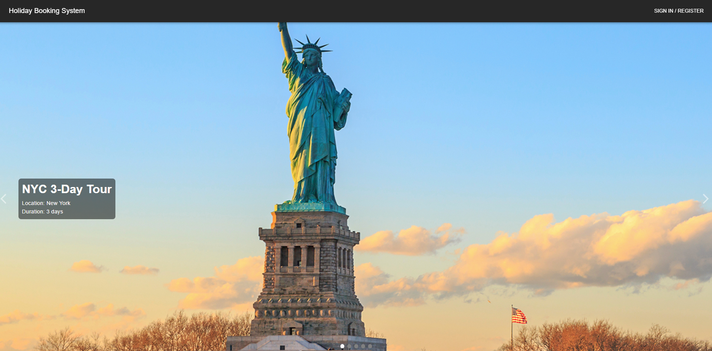
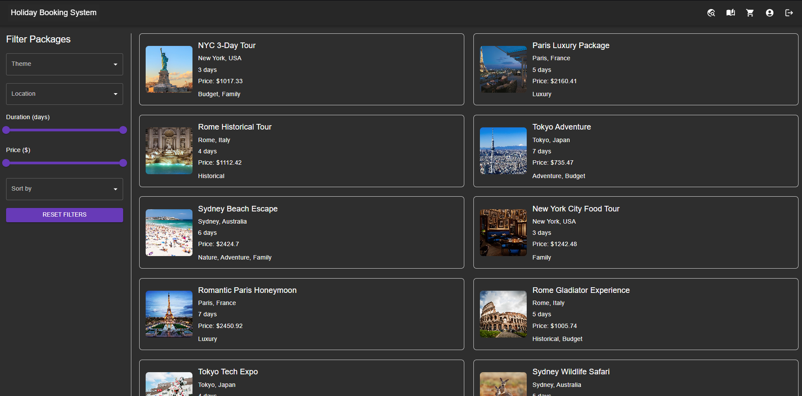
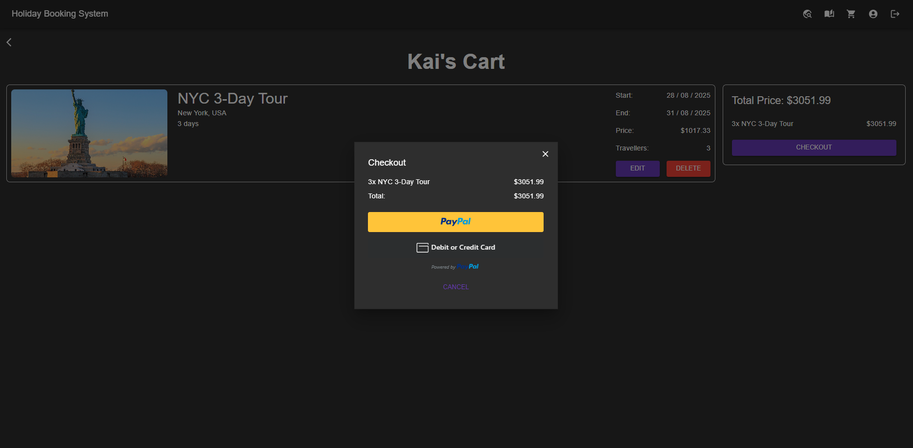

# Bookings Website

This project is a holiday booking website. Features include:

- User registration & login
- Admin panel
- Booking system
- PayPal integration

## Screenshots






## Installation

### Backend (Flask)

Navigate to the backend directory and run:
```bash
cd code/backend
flask run
```
### Frontend (REACT)
In another terminal, navigate to the frontend directory and run:

```bash
cd code/frontend
npm install
npm start
```